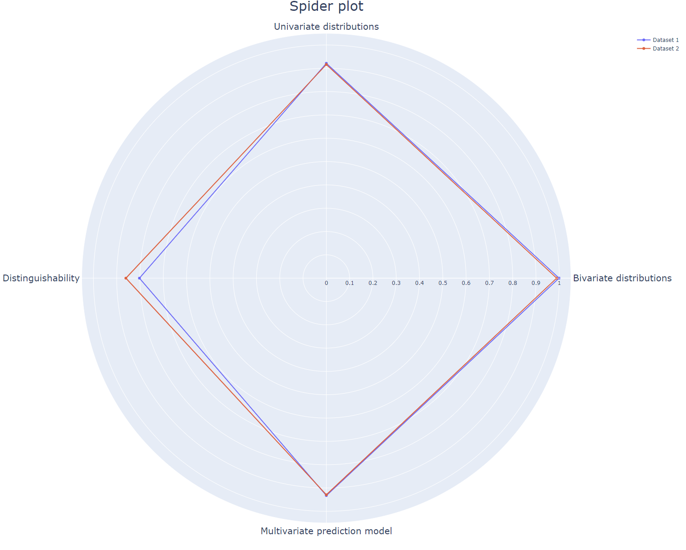

# TNO PET Lab - Synthetic Data Generation (SDG) - Tabular - Evaluation - Utility Metrics

The TNO PET Lab consists of generic software components, procedures, and
functionalities developed and maintained on a regular basis to facilitate and
aid in the development of PET solutions. The lab is a cross-project initiative
allowing us to integrate and reuse previously developed PET functionalities to
boost the development of new protocols and solutions.

The package `tno.sdg.tabular.eval.utility_metrics`` is part of the
[TNO Python Toolbox](https://github.com/TNO-PET).

Extensive evaluation of the utility of synthetic data sets. The original and
synthetic data are compared on distinguishability and on a univariate, bivariate
and multivariate level.

The main functionalities are:

- Univariate distributions: shows the distributions of one variable for the
  original and synthetic data.
- Bivariate correlations: visualises a Pearson-r correlation matrix for all
  variables.
- Multivariate predictions: shows an SVM classifier predicts accuracies for each
  variable training on either original or synthetic data tested on original
  data.
- Distinguishability: shows the AUC of a logistic classifier that classifies
  samples as either original or synthetic.
- Spiderplot: generates spider plot for these four metrics.

_Limitations in (end-)use: the content of this software package may solely be
used for applications that comply with international export control laws._  
_This implementation of cryptographic software has not been audited. Use at your
own risk._

## Documentation

Documentation of the `tno.sdg.tabular.eval.utility_metrics` package can be found
[here](https://docs.pet.tno.nl/sdg/tabular/eval/utility_metrics/0.3.0).

## Install

Easily install the `tno.sdg.tabular.eval.utility_metrics` package using `pip`:

```console
$ python -m pip install tno.sdg.tabular.eval.utility_metrics
```

If you wish to run the tests you can use:

```console
$ python -m pip install 'tno.sdg.tabular.eval.utility_metrics[tests]'
```

## Usage

All four metrics are visualised in one plot with a spider plot. Where `1`
represents 'complete overlap' and `0` represents 'no overlap' between original
and synthetic data. This plot can depict multiple synthetic data sets. Therefore
it can be used to evaluate different levels of privacy protection in synthetic
data sets, varying parameter settings in synthetic data generators, or
completely different synthetic data generators.

All individual metrics depicted in the spider plot can be visualised as well.
The examples below show you step by step how to generate all visualizations.

Note that any required pre-processing of the (synthetic) data sets should be
done prior. Take into account addressing NaNs, missing values, outliers and
scaling the data.

For more information on the selected metrics, please refer to the paper (link
will be added upon publication). As we aim to keep developing our code feedback
and tips are welcome.



This example evaluates utility of synthetic data. We evaluate univariate,
bivariate, multivariate utility and distinguishability (record-level utility).
All four dimensions are depicted in a radar chart/spider plot. All the required
computations are performed with the function `compute_all`. Multiple synthetic
data sets can be used as input.

To run the example you need the data found in `example/datasets`.

### Loading the data

To load the example data you can use the following snippet.

```python
import pandas as pd

original_data = pd.read_csv("original_dataset.csv", index_col=0)
synthetic_data_1 = pd.read_csv("synthetic_dataset_1.csv", index_col=0)
synthetic_data_2 = pd.read_csv("synthetic_dataset_2.csv", index_col=0)

# Specify numerical and categorical columns
numerical_column_names = ["col1", "col2"]
categorical_column_names = ["col3", "col4"]
```

### Computing metrics and generating a spider plot

Using the loaded data you can compute all four utility metrics and generate a
spider plot (written to `spiderplot.html`).

```python
from tno.sdg.tabular.eval.utility_metrics import (
    compute_all_metrics,
    compute_spider_plot,
)


computed_metrics = compute_all_metrics(
    original_data,
    {"Dataset 1": synthetic_data_1, "Dataset 2": synthetic_data_2},
    categorical_column_names,
)

spider_plot = compute_spider_plot(computed_metrics)
spider_plot.write_html(file="spiderplot.html", auto_open=True)
```

### Plotting univariate distributions

The univariate distributions can be plotted as follows. Plots are stored in
`distribution_<column>.png`, where `<column>` refers to the respective column.

```python
from tno.sdg.tabular.eval.utility_metrics import visualise_distributions


figures = visualise_distributions(
    original_data,
    synthetic_data_1,
    ["col1", "col2", "col3", "col4"],
    cat_col_names=categorical_column_names,
)
for col, fig in figures.items():
    fig.savefig(f"distribution_{col}.png", dpi=300, bbox_inches="tight")
```

### Bivariate plots

The correlation between columns can be plotted using the snippet below and are
written to `correlation_matrices.png`.

```python
from tno.sdg.tabular.eval.utility_metrics import visualise_correlation_matrices


(
    correlation_matrix_original,
    correlation_matrix_synthetic,
    cor_fig,
) = visualise_correlation_matrices(
    original_data, synthetic_data_1, categorical_column_names
)
cor_fig.savefig("correlation_matrices.png", dpi=300, bbox_inches="tight")
```

### Multivariate plots

Plotting classification tasks for all columns while converting numerical columns
to categories.  
Output is stored in `svm_classification.png`.

```python
from tno.sdg.tabular.eval.utility_metrics import visualise_accuracies_scores


(
    accuracies_scores_original,
    accuracies_score_synthetic,
    pred_fig,
) = visualise_accuracies_scores(
    original_data, synthetic_data_1, categorical_column_names
)
pred_fig.savefig("svm_classification.png", dpi=300, bbox_inches="tight")
```

Plotting regression and classification task for numerical and categorical
columns.  
Output is stored in `svm_regression_classification.png`.

```python
from tno.sdg.tabular.eval.utility_metrics import visualise_prediction_scores


(
    prediction_scores_original,
    prediction_score_synthetic,
    pred_fig_regr,
) = visualise_prediction_scores(
    original_data, synthetic_data_1, categorical_column_names
)
pred_fig_regr.savefig("svm_regression_classification.png", dpi=300, bbox_inches="tight")
```

### Distinguishability

Plotting distinguishability by classifying synthetic and original samples with
propensity score.  
Output is stored in `propensity_scores.png`.

```python
from tno.sdg.tabular.eval.utility_metrics import visualise_propensity_scores


propensity_scores, prop_fig = visualise_propensity_scores(
    original_data, synthetic_data_1, categorical_column_names
)
prop_fig.savefig("propensity_scores.png", dpi=300, bbox_inches="tight")
```

Plotting Area Under Curve for False Positive and True Positive rates for
classifying synthetic and original samples.  
Output is stored in `AUC_curves.png`.

```python
from tno.sdg.tabular.eval.utility_metrics import visualise_logistical_regression_auc


predictions, utility_disth, auc_fig = visualise_logistical_regression_auc(
    original_data, synthetic_data_1, categorical_column_names
)
auc_fig.savefig("AUC_curves.png", dpi=300, bbox_inches="tight")
```
